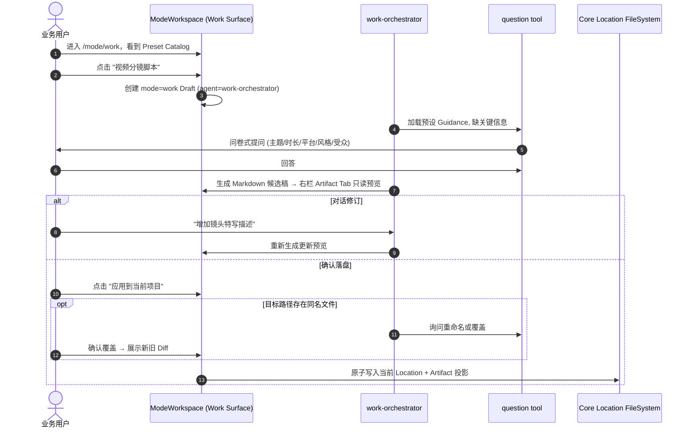

# Work 模式 M1 实施计划：预设驱动文档闭环

> 状态：**Implemented + merged**（2026-08-01，Phase A-F + D3-D5 首页收尾已实现，merge `a041ca617` 合入 main；本文转为实施记录。审批修订历史：D1/D2 定案 + M1-M3、v1.2 补 D3-D5）
> 范围：`packages/schema` + `packages/core` + `packages/aigcfroge` + `packages/app`
> 关联：[Work PRD v4.1](../prd/work-mode-execution-layer.md)（范围真源）、[Work 模式路线图](work-mode-roadmap.md)（本计划的上级）、[ADR-13](../architecture/adr/ADR-13-chat-work-mode-boundary.md)、[ADR-14](../architecture/adr/ADR-14-persistence-and-scope-strategy.md)、[ADR-15](../architecture/adr/ADR-15-mode-workspace-main-area-slot.md)、[ARCHITECTURE.md](../../ARCHITECTURE.md) §4.10、[Chat M1 实施计划](chat-mode-creation-layer-m1.md)（范式参考）
> 依据：`CLAUDE.md`、根/包级 `AGENTS.md`、`effect`/`frontend-theming` skills、实际 V1/V2 Session/Agent/Tool/API/App 代码
> 分支：**work**（从 main 切出，与 todo 分支并行）
> 最后更新：2026-08-01

---

## 0. 审批状态与执行 Gate

| Gate | 条件 | 状态 | 阻塞范围 |
|---|---|---|---|
| **G0 范围真源** | Work PRD v4.1 已 Approved；ARCHITECTURE.md 同步（PRD §15.1 W1 三项）已提交 | ✅ 已满足（W1 三项 :210/:258/:261 已随 2026-08-01 批准链提交，见路线图 §7） | 全部 Phase |
| **G1 预设契约** | 产品确认 M1 预设清单（§3.1）、澄清问题模板、落盘默认路径 | 待定 | Phase A-E |
| **G2 安全边界** | Core/Security owner 接受：候选稿=消息正文（D1 已定案 §3.4）+ 只读预览 + 同名冲突 Diff 确认 + 原子写入模型（§4.3）+ work-orchestrator 无 edit/shell 工具（§4.2） | 待定（D1 已定案，可评） | Phase D-E |
| **G3 灰度/分析** | M1 埋点事件（PRD §12 六个 work_* 事件）owner 确认 | 待定 | 不阻塞内部闭环 |

**本 M1 与 Todo 分支的边界**（路线图 §2.2 禁区，必须遵守）：
- ❌ 不实现 ProgressLedger Schema/Service（M1.5 范围，依赖 Todo M1 Task 模型）
- ❌ 不实现步骤追踪/断点恢复
- ❌ 不新建全局 Work 工作区（ADR-14：产出落用户选择 Location）
- ❌ 不内嵌富文本编辑器（修改走对话）

---

## 1. 目标、非目标与本次收敛

### 1.1 M1 目标

非编程用户进入 `/mode/work`，看到**官方预设卡片库**（按职业/场景分类），点击预设（如"视频分镜脚本"）进入绑定 `mode=work`、`agent=work-orchestrator` 的 Draft/Session，通过**多轮澄清**（对小白提供问卷选项）补齐关键信息，生成结构化 Markdown 候选稿，在**右栏只读预览**（含 Context Tab 对齐 Code 模式）检查后，点击"应用到当前项目"——若目标路径存在同名文件则触发**同名冲突询问**（重命名/覆盖 + Diff 确认），经确认后**原子写入**当前 Session Location，并建立 **Artifact 投影**（引用不复制正文，ADR-14）。

### 1.2 非目标

- ❌ 不创建 Progress Ledger 步骤追踪（M1.5）
- ❌ 不做断点恢复 Resume（M1.5）
- ❌ 不做"存为资产"（M2）
- ❌ 不做 DataAnalysis/图表产出（M3）
- ❌ 不创建 Skill/Command/MCP 资产
- ❌ 不做自定义 Preset 的创建/持久化（PRD §6.2：必须去 Chat 模式）
- ❌ 不开放 Shell、浏览器自动化或未授权网络写（PRD §6.2）
- ❌ 不新增数据库 migration（M1 无新表，Artifact 投影走内存态 session-scoped 记录，ADR-15 §5）

### 1.3 相对 PRD 的收敛

| PRD 描述 | M1 实施收敛 |
|---|---|
| 12+5 泛人群全部预设 | **M1 只落地 3-4 个高置信预设**（如视频分镜脚本、PRD 撰写、文献综述、行政公文），其余预留分类入口 |
| Preset Catalog 按场景/职业分类 | 分类 = IT 研发 / 视频创作 / 学术科研 / 行政通用（4 分类） |
| 元智能体深度需求澄清 | work-orchestrator agent + question tool 问卷（不依赖 meta-agent V2 编排） |
| 右栏 Context Tab 完全对齐 Code 模式 | 复用 `session-context-tab.tsx`（mode-agnostic，442 行），Work 下直接挂载 |
| 同名冲突 LLM 自动询问 | work-orchestrator 检测目标路径 → 走 question tool 询问重命名/覆盖 → Diff 确认 |
| 原子落盘 + Artifact 投影 | 对齐 Chat M1 PromptAssetService 事务模式；Artifact 内存态记录（不落库） |

---

## 2. 背景与当前状态

### 2.1 现有基座（已就绪，直接复用）

| 能力 | 文件 | 状态 |
|---|---|---|
| ModeWorkspace typed slot | `packages/app/src/pages/mode-workspace-slots.tsx` | ✅ 已实现（`PlaceholderMain` 在 :524） |
| MODE_SURFACES 注册表 | `packages/app/src/components/mode-surfaces.tsx:317-319` | ✅ Work 注册为 Placeholder，待替换 |
| Context Tab | `packages/app/src/components/session/session-context-tab.tsx`（442 行, mode-agnostic） | ✅ 已挂载 `session-side-panel.tsx:351-355` |
| question tool | V2 LLM-facing: `packages/core/src/tool/question.ts`（V1 实现 `aigcfroge/src/question/`） | ✅ 已注册 `builtins.ts:9` |
| chat-orchestrator 范式 | `packages/core/src/agent/prompt/chat-orchestrator.ts` | ✅ 类比创建 work-orchestrator |
| 会话右栏双 Tab 结构 | `session-side-panel.tsx` | ✅ 已有，Work 需新增 Artifact Tab |
| ModeWorkspace 会话列表 | `CodingSessionListMain`（:155） | ✅ 可类比 Work Session 列表 |
| 资产事务模式 | Chat M1 PromptAssetService | ✅ 类比 Artifact 原子写入 |

### 2.2 需新建

| 交付物 | 位置 | 说明 |
|---|---|---|
| Preset Schema + Registry | `packages/schema/src/work-preset.ts` + `packages/core/src/session/work-preset.ts` | 官方硬编码预设，4 分类 3-4 个 |
| work-orchestrator agent | `packages/core/src/agent/prompt/work-orchestrator.ts` | Work 专属执行 agent（类比 chat-orchestrator） |
| work-preset tool | `packages/core/src/tool/work-preset.ts` | 供 LLM 读取预设指引 |
| Artifact 记录 | `packages/core/src/session/artifact.ts` | 内存态 session-scoped（ADR-15 §5 不落库） |
| Work Surface UI | `mode-workspace-slots.tsx` 新增 `WorkPresetCatalogMain` + Work Sidebar | 替换 Placeholder |
| Artifact Tab | `session-side-panel.tsx` 新增 | 只读预览 + 应用按钮 + 同名冲突 |
| 同名冲突流程 | work-orchestrator + question tool | 重命名/覆盖 + Diff |

---

## 3. 范围

### 3.1 Preset 清单（G1 需产品确认）

M1 建议落地 4 个高置信预设（PRD §5 真伪需求矩阵选取）：

| Preset | 分类 | 目标用户 | 澄清问题（≤5 个） | 产出 |
|---|---|---|---|---|
| 视频分镜脚本 | 视频创作 | 视频创作者 | 视频主题/时长/平台/风格/目标受众 | Markdown 双栏分镜表 |
| 撰写 PRD | IT 研发 | PO/产品 | 产品背景/目标用户/核心功能/验收标准 | Markdown PRD |
| 文献对比综述 | 学术科研 | 科研人员 | 研究主题/文献数量/比较维度/格式 | Markdown 综述 + 比较矩阵 |
| 撰写行政公文 | 行政通用 | AI 小白 | 文种/事由/对象/格式要求 | 规范公文 Markdown |

**预留**：其余 8+ 预设（BA Gherkin、架构 ADR、Game GDD 等）仅显示卡片 + "即将上线"，不提供虚假创建入口（对齐 Chat M1 §1.2 原则）。

### 3.2 澄清设计

- work-orchestrator 每次执行先加载预设 Guidance（`work-preset` tool 读取）
- 缺关键信息 → 走 question tool（V2: `packages/core/src/tool/question.ts`）弹问卷
- 小白模式：预设标记 `guided: true` → 强制问卷式，不生成空泛模板（PRD §7 用户故事）

### 3.3 Preset Schema 契约

```ts
// packages/schema/src/work-preset.ts
export const WorkPreset = Schema.Struct({
  id: Schema.String,                    // "storyboard-video"
  title: Schema.String,                 // "视频分镜脚本"
  category: Schema.Literal(
    "it-development", "video-creation", "academic", "general-office"
  ),
  description: Schema.String,
  guided: Schema.Boolean,               // 小白问卷模式
  guidance: Schema.String,              // 预设指引 (LLM system 注入)
  questions: Schema.Array(Schema.Struct({
    key: Schema.String,
    prompt: Schema.String,
    required: Schema.Boolean,
    options: Schema.optional(Schema.Array(Schema.String)),
  })),
  outputType: Schema.Literal("markdown", "table", "mixed"),
  artifact: Schema.Struct({
    title: Schema.String,
    filename: Schema.String,            // 默认文件名模板
    relativeDir: Schema.String,         // 默认子目录 (可选)
  }),
}).annotate({ identifier: "WorkPreset" })
```

### 3.4 Artifact 契约（内存态，不落库）

```ts
// packages/core/src/session/artifact.ts — 对齐 ADR-14 §4 + PRD §9.2
export const ArtifactRecord = Schema.Struct({
  id: Schema.String,                    // 稳定 Artifact ID
  sessionID: Schema.String,
  kind: Schema.Literal("document"),     // M1 固定
  title: Schema.String,
  mediaType: Schema.Literal("text/markdown"),
  relativePath: Schema.String,          // 相对 Session Location, 规范化后不得越界
  status: Schema.Literal("available", "missing"),
  createdAt: Schema.Number,
  updatedAt: Schema.Number,
}).annotate({ identifier: "ArtifactRecord" })
```

**候选稿载体决策（D1，Phase A 定案）**：采用**方案 (a) — 候选稿 = assistant 消息内容**。

- 生成 → 预览 → 落盘的数据流：work-orchestrator 将候选 Markdown 作为 **assistant 消息正文**产出 → 右栏 Artifact Tab **渲染该消息** → 用户点"应用到当前项目"时，Core 从消息正文写入目标文件，并建立 Artifact 投影。
- **落盘前无文件可引用**，Artifact 投影只在写入成功后建立（`status=available`），此时才有 `relativePath` 可引用。
- 因候选稿在消息中，**work-orchestrator 不配备 `edit` 工具**（见 §4.2）——杜绝 agent 直接改文件绕过冲突/Diff 确认。

**Artifact 状态流（D2，Phase A 定案）**：采用**内存态事件**，参照 `SessionTodo` 发 `todo.updated` 的 EventV2 bridge 模式（`packages/core/src/session/todo.ts:20-27`）。新增轻量事件 `work.artifact_applied`（sessionID + artifactID），App 侧监听后更新 Artifact Tab。ADR-15 §5 允许不落库——事件仅内存态，跨刷新丢失可接受（M1 接受，M2 存为资产时转 Chat 资产持久化）。

### 3.5 Work 首页收尾（D3-D5 定案，2026-08-01）

在 Phase A-F 基础上补齐首页三区块。背景：现网首页只有预设网格（`WorkPresetCatalogMain`），缺 PRD §10.1 要求的 mode=work 历史会话列表；Chat 工作流资产（第 6 类资产，M5 已开闸）尚无 Work 消费入口。

**决策**：

- **D3（工作流资产执行 = 引导降级）**：Chat 的 `WorkflowAsset`（`steps[]` 多 agent DAG）**无执行引擎**——ADR-13 Amendment-1 §5b 延期至 Work PRD 阶段；`core/src/workflow-asset.ts` 仅注册表，`steps` 以 `unknown` 存储、从不解释。M1 不建引擎，采用**引导降级**：点卡片 → 建 `mode=work` 会话，workflow 的 name/description/steps 摘要内嵌 seed（新增 `workflowLaunch`，类比 `presetLaunch`）→ work-orchestrator 按其执行。orchestrator SYSTEM_PROMPT 需增加兜底分支："用户消息已给出任务规格（工作流名+步骤）则跳过 `work-preset` 加载，直接按其执行"（现 `:19` 强制先加载预设指引）。卡片角标**显式标注"由你的工作流驱动（引导模式）"**，杜绝假执行（No Cheating）。真执行引擎（StepDef 解释器 + 分支/并行调度 + 状态持久化，可搭 TaskDriver 的 `createChild`/`delegate` 积木）M2 立项后无缝升级。
- **D4（资产范围 = 只上 workflow）**：prompt 资产仅 `template`，无 questions/artifact 契约（`schema/src/prompt-asset.ts`），启动 = 重复 Chat"插入 Composer"路径（Chat M1 已实现），不提供任务契约。Work 首页资产区**只收 workflow 类**，保持"任务启动"心智。
- **D5（继续工作 = M1 会话元数据）**：复用 `buildHomeSessionRecords` + `HomeSessionRow` + `session.mode === "work"` 过滤（对齐 `CodingSessionListMain`，`mode-workspace-slots.tsx:218-228`），点击重开会话续接。状态徽章（completed/in_progress）与断点恢复依赖 Task 模型（M1.5，todo 分支），M1 不伪造。
  - **位置修正**：会话历史置于**主区顶部（区块①，回归路径最强）**而非初拟的侧栏（覆盖 §4.4 "侧栏 work 会话列表"）——侧栏保持 Location + 新建任务最小形态。

**改动清单**（全复用，无新引擎）：

| 项 | 位置 |
|---|---|
| 继续工作区块 | `mode-workspace-slots.tsx`（复用 home-shared.tsx 管道 + `focusedSync().project.loadSessions`） |
| 工作流资产卡片 | `mode-workspace-slots.tsx`（`useChatDirectory` → `workflowAsset.list()`） |
| `workflowLaunch` | `work-preset-launch.ts` 新增纯函数（导出与渲染分离，可测） |
| orchestrator 兜底 | `core/src/agent/prompt/work-orchestrator.ts` SYSTEM_PROMPT 增加无 preset 分支 |
| 主区宽度 | `mode-workspace.tsx:142` work 分支 720px → ~960px/1fr |
| i18n | `en.ts` + `zht.ts`（`work.home.*` / `work.asset.*`，parity 约束） |

**估时**：继续工作 ~0.5d · 工作流资产 ~1.5d · i18n/文档 ~0.5d ≈ **2.5d**（并入 §9 G）。

---

## 4. 关键设计

### 4.1 用户主流程



### 4.2 work-orchestrator agent

类比 `chat-orchestrator.ts`（`packages/core/src/agent/prompt/chat-orchestrator.ts:17`）：

```ts
// packages/core/src/agent/prompt/work-orchestrator.ts
// 职责: 加载 preset guidance → 澄清 → 生成(候选稿=消息正文) → 修订
// 工具集: work-preset (读指引), question (问卷澄清), read (校验)
// ⚠️ 无 edit 工具: 候选稿作为 assistant 消息产出, 落盘由 UI "应用"动作触发 (D1 方案 a)
// 边界: 无 task/spawn (不嵌套), 无 shell/browser (PRD §6.2), 无 edit (防绕过冲突确认)
```

**注册与强制绑定**：除 AgentV2 注册（`packages/core/src/plugin/agent.ts`）外，必须改 `packages/core/src/product-mode-agent-policy.ts`：

- `resolvePrimaryAgent(:40-44)` 增加 `mode=work` → `work-orchestrator` 映射；
- `checkPrimaryAgent(:67-86)` 对 work 模式强制 primary agent = work-orchestrator（否则绑定只是约定不是约束）；
- `checkCommandAllowed(:91-99)` 对 work 模式 deny shell/command 类——这是 PRD §6.2"不开放 Shell"的现成执行点。

### 4.3 安全落盘模型（G2 需确认）

对齐 Chat M1 PromptAssetService 事务模式（`chat-mode-creation-layer-m1.md` §3.3）：

| 环节 | 机制 |
|---|---|
| 只读预览 | Artifact Tab 渲染 assistant 候选消息（Markdown），无编辑入口 |
| 同名冲突 | work-orchestrator 检测目标路径 → question tool 询问重命名/覆盖 |
| 覆盖确认 | 展示新旧 Diff（复用 Coding 审查 tab diff：`review-tab.tsx` + `@/utils/diffs`）→ 用户显式确认 |
| 原子写入 | Location-scoped 事务锁 + 临时文件 + rename（对齐 Chat M1 writeAtomic）；写入内容从候选消息正文读取（D1 方案 a） |
| 路径校验 | `relativePath` 规范化 + 禁止 `..`/绝对路径/符号链接越界（ADR-14 §1） |
| Artifact 投影 | 成功写入后建立内存态记录 `status=available` + 发 `work.artifact_applied` 事件（D2） |

### 4.4 Work Surface UI

`mode-workspace-slots.tsx` 新增两个组件：

```tsx
// 主区: Preset Catalog (替代 PlaceholderMain)
export function WorkPresetCatalogMain() {
  // 4 分类 + 预设卡片 + 历史 work 会话列表
  // 点击预设 → 创建 mode=work Draft
}

// 侧栏: Work 功能导航 (替代 PlaceholderSidebar)
export function WorkProjectColumnSidebar() {
  // 项目 Location 选择器 + work 会话列表 (mode=work 过滤)
}
```

注册到 `mode-surfaces.tsx`（:316-319 替换 Placeholder）并**钉死集成点（M3）**：

```tsx
work: {
  Sidebar: () => <WorkProjectColumnSidebar />,
  Main: () => <WorkPresetCatalogMain />,
  RightPanel: WorkArtifactPanel,  // 渲染于 session-side-panel 右栏
}
```

**右栏集成点**：Artifact Tab 与 Context Tab **并列于 `session-side-panel.tsx`**（context tab 已在 `:351-355` 挂载；work 模式当前在 `:482-487` 渲染 `PlaceholderPanel`，替换为 `WorkArtifactPanel`）。Tab 结构由 session-side-panel 提供，Artifact Tab 的**内容**由 `MODE_SURFACES.RightPanel` 注册的 `WorkArtifactPanel` 渲染——同一集成点，不引入第二处渲染路径。

### 4.5 Artifact Tab（右栏）

- 复用 `session-side-panel.tsx` 双 Tab 结构，新增 Artifact Tab
- Context Tab 直接复用 `packages/app/src/components/session/session-context-tab.tsx`（mode-agnostic，零改动）
- Artifact Tab：**渲染候选 assistant 消息**（D1 方案 a，非文件）+ "应用到当前项目" 按钮 + 目标相对路径展示
- 落盘成功后 Core 发 `work.artifact_applied` 事件（D2）；M1 面板以本地内容比对判定已应用（绑定 sessionID，支持修订回退），事件保留供 M2/外部消费

---

## 5. 阶段划分

| Phase | 内容 | 退出条件 |
|---|---|---|
| **A 契约** | Preset Schema + Artifact Record Schema + 4 预设数据 + **D1/D2 定案**（候选稿=消息正文；`work.artifact_applied` 事件） | Schema 评审通过；D1/D2 决策写入契约 |
| **B Agent** | work-orchestrator + work-preset tool + agent 注册（`plugin/agent.ts`）+ **`product-mode-agent-policy.ts` 强制绑定**（`resolvePrimaryAgent:40` work→work-orchestrator、`checkPrimaryAgent:67` 强制、`checkCommandAllowed:91` deny shell） | tool 单测 + 策略测试通过 |
| **C Surface** | WorkPresetCatalogMain + WorkProjectColumnSidebar + MODE_SURFACES 注册（:316-319） | /mode/work 显示 Preset Catalog |
| **D 澄清闭环** | question tool 问卷接入 + 生成候选稿（消息正文）→ 右栏预览 | 端到端：选预设→答问卷→出预览 |
| **E 落盘** | 同名冲突询问 + Diff 确认 + 原子写入（从消息正文）+ Artifact 投影 + `work.artifact_applied` 事件 | 内部 50 次测试达标 |
| **F 打磨** | i18n 补齐（含 zht + parity 约束）、埋点事件、E2E | typecheck/lint/test 通过 |
| **G 首页收尾** | 继续工作区块（复用 HomeSession 管道）+ 工作流资产卡片（引导降级）+ orchestrator 无 preset 兜底（D3-D5） | /mode/work 首页三段式可见；卡片角标标注引导模式 |

---

## 6. 关键文件

| 文件 | 动作 |
|---|---|
| `packages/schema/src/work-preset.ts` | 新增 |
| `packages/core/src/session/work-preset.ts` | 新增 (Preset Registry, 硬编码数据) |
| `packages/core/src/session/artifact.ts` | 新增 (Artifact 内存态记录 + `work.artifact_applied` 事件) |
| `packages/core/src/tool/work-preset.ts` | 新增 (LLM 读预设指引) |
| `packages/core/src/agent/prompt/work-orchestrator.ts` | 新增 (类比 chat-orchestrator) |
| `packages/core/src/plugin/agent.ts` | 修改 (注册 work-orchestrator) |
| **`packages/core/src/product-mode-agent-policy.ts`** | **修改 (强制绑定: resolvePrimaryAgent:40 work→work-orchestrator, checkPrimaryAgent:67, checkCommandAllowed:91 deny shell)** |
| `packages/core/src/tool/builtins.ts` | 修改 (注册 work-preset; V2 question tool 在 `core/src/tool/question.ts`) |
| `packages/app/src/pages/mode-workspace-slots.tsx` | 修改 (WorkPresetCatalogMain + WorkProjectColumnSidebar) |
| `packages/app/src/components/mode-surfaces.tsx` | 修改 (:316-319 替换 Placeholder) |
| `packages/app/src/pages/session/session-side-panel.tsx` | 修改 (新增 Artifact Tab; :482-487 PlaceholderPanel → WorkArtifactPanel) |
| `packages/app/src/i18n/en.ts` + `zht.ts` | 修改 (work.* 文案; 注意 18 locale 受 `parity.test.ts` 键值 parity 约束) |
| `packages/app/src/pages/work-preset-launch.ts` | 修改（新增 `workflowLaunch`，类比 `presetLaunch`，见 §3.5） |
| `packages/core/src/agent/prompt/work-orchestrator.ts` | 修改（SYSTEM_PROMPT 增加"用户消息已给出任务规格则跳过 work-preset 加载"兜底，见 §3.5） |
| `packages/app/src/pages/mode-workspace.tsx` | 修改（work 主区 720px → ~960px/1fr，支撑首页三段式，见 §3.5） |

---

## 7. 测试策略

| 层 | 覆盖 | 工具 |
|---|---|---|
| Schema | Preset/Artifact Schema 类型负测试 | `bun --cwd packages/schema test` |
| Core | work-preset tool 单测、work-orchestrator prompt 结构、Artifact 路径校验 | `bun --cwd packages/core test` |
| App | MODE_SURFACES 注册正确性、Artifact Tab 渲染 | 组件测试 |
| E2E | /mode/work 选预设 → 澄清 → 预览 → 落盘全流程 | Playwright |

**命令**（CLAUDE.md 测试规范）：
```bash
bun --cwd packages/schema test
bun --cwd packages/core test --timeout 30000
bun --cwd packages/app test
bun --cwd packages/core typecheck
bun run lint
```

---

## 8. 验收清单

- [ ] `/mode/work` 显示 4 分类 Preset Catalog，预留预设卡片不提供虚假创建入口
- [ ] 点击"视频分镜脚本"→ 创建 mode=work Draft（agent=work-orchestrator）
- [ ] 缺关键信息 → 问卷式提问（≤5 题），小白模式强制问卷
- [ ] 生成 Markdown 候选稿 → 右栏 Artifact Tab 只读预览
- [ ] Context Tab 与 Code 模式一致（文件引用 + Token 占用透明）
- [ ] 目标路径同名 → 询问重命名/覆盖 → Diff 确认后才落盘
- [ ] 原子写入当前 Location + Artifact 投影 `status=available`
- [ ] 修改通过对话指令完成（无内嵌编辑器）
- [ ] 未授权写入/跨界读取 = 0（安全审计）
- [ ] 埋点事件 `work_task_started`/`work_preview_ready`/`work_artifact_applied` 上报

---

## 9. 估算

| Phase | 估时 |
|---|---|
| A 契约 | 1d |
| B Agent | 2d |
| C Surface | 2d |
| D 澄清闭环 | 2d |
| E 落盘 | 2d |
| F 打磨 | 1d |
| G 首页收尾 | 2.5d |
| **总计** | **12.5d** |

---

## 10. 风险与应对

| 风险 | 概率 | 影响 | 应对 |
|---|---|---|---|
| work-orchestrator 生成质量不稳定 | 高 | 中 | 预设 Guidance 精调 + question tool 补齐关键信息 + 内部 50 次测试 |
| 同名冲突 Diff 确认用户体验 | 中 | 中 | 复用 Coding 审查 tab diff（`review-tab.tsx` + `@/utils/diffs`） |
| Preset 文案与 12+5 工种偏差 | 中 | 高 | M1 只落 4 个高置信预设，邀请内测用户校准（PRD §14） |
| Artifact 内存态记录跨刷新丢失 | 中 | 低 | M1 接受（ADR-15 §5 不落库），M2 存为资产时转 Chat 资产持久化 |
| 与 todo 分支耦合风险 | 低 | 高 | 遵守 §0 禁区，不实现 ProgressLedger/步骤追踪 |
