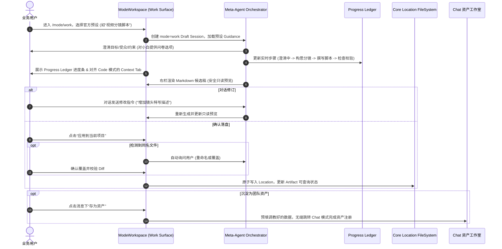

# PRD：Work 模式 - 非编程执行层（预设任务 → 过程可视化 → 安全交付）

> 状态：**Approved**（2026-07-31 全权 owner 拍板；Gate 1-4 签字见 §15.1）
> 负责人：产品（范围与指标）/ Core（Artifact 契约 & Progress Ledger）/ App（Work surface & Context Inspector）/ Security（写入边界 & 跨 Location 授权）
> 范围：`packages/app` + `packages/core` + `packages/aigcfroge` + `packages/schema`
> 关联：[ADR-11](../architecture/adr/ADR-11-product-mode-session-classification.md)、[ADR-12](../architecture/adr/ADR-12-product-mode-entry-routing.md)、[ADR-13](../architecture/adr/ADR-13-chat-work-mode-boundary.md)（已接受）、[ADR-13 Amendment-1](../architecture/adr/ADR-13-amendment-1-workflow-asset.md)（工作流定义归 Chat，执行归 Work）、[ADR-14](../architecture/adr/ADR-14-persistence-and-scope-strategy.md)（已接受）、[ADR-15](../architecture/adr/ADR-15-mode-workspace-main-area-slot.md)（已接受）、[ARCHITECTURE.md](../../ARCHITECTURE.md) §4.10、[CONTEXT.md](../../CONTEXT.md)、[Chat PRD](chat-mode-creation-layer.md)、[Meta-Agent PRD](meta-agent-orchestrator.md)
> 最后更新：2026-07-31（v4.0 全面升级：对齐 Chat PRD v4 结构，融入 12+5 泛人群真需求、Progress Ledger 断点恢复、Context Inspector、同名冲突询问与”存为资产”通道；v4.1 修订：Progress Ledger 与 Todo/Task 升级计划统一为同一模型；v4.2 修订注记 2026-08-03：Progress Ledger 的可视化载体 SessionTodoProgress 立项 M7 统一轨道 UX 重构——轨道下移标题行下方、四态状态机含 idle 静态留存、几何/填充索引语义修复、session_task 双源 freshness 修复，决策全录见计划 §5.8，不影响本 PRD 的 Ledger 数据模型）
> 关联计划：[Todo/Task 系统升级实施方案](../plan/todo-task-system-upgrade.md)（Progress Ledger = Task List 子集，两文档交叉裁决于 2026-07-31）

---

## 1. 三行摘要

- **做什么**：Work 模式是产品的非编程执行层——通过硬编码系统预设（Presets）引导非编程用户完成结构化交付任务，提供 Progress Ledger 实时步骤追踪、断点恢复 (Resume)、只读安全预览、同名冲突询问与原子落盘；成功产出支持一键“存为资产”无缝沉淀至 Chat 资产工作室。
- **为谁做**：从 IT/软件研发 12 大工种（PO/BA/UI/Architect/FE/BE/QA/SRE/Growth/MarOps/Data/Risk）到泛办公与创作人群（视频创作者、游戏策划、科研人员、学生、AI 零基础小白）。
- **为什么现在做**：ADR-11~15 架构基座及 Chat 模式资产开闸（M1~M7）均已落盘完成，必须补齐 Work 模式“开箱即用消费执行 -> 过程可视化 -> 安全落盘 -> 资产逆向沉淀”的非编程闭环。

---

## 2. 问题与定位

现有 Coding 体验以代码库、终端和开发工具为中心。非编程与泛办公用户需要的是明确的业务任务入口、深度的需求澄清与可置信检查的交付物，而不是手动配置 Agent、Skill、MCP 或安装复杂环境。

> 用户真实诉求：我不需要懂什么 Prompt 或 Agent 组装，我只要点击‘视频分镜脚本’或‘撰写 PRD’，回答几个关键问题，就能在右边检查完整的结构化文档，确认后安全保存到我的项目目录里。

Work 是**非编程执行层**：

- **消费与执行**：Work 消费官方硬编码预设（Presets）或已注册的 Chat 资产，直接执行一次性业务任务。
- **资产沉淀归 Chat**：Work 模式本身**不直接**创建或管理可复用资产。若用户希望将本次成功的任务逻辑沉淀为团队可复用工作流（Recipe/Workflow），需通过消息级“存为资产”跳转至 **Chat 模式** 进行校验与落盘（严格遵循已接受的 ADR-13/14）。

---

## 3. 架构前提

| 决策                                         | 当前状态               | 本 PRD 处理                                                   |
| -------------------------------------------- | ---------------------- | ------------------------------------------------------------- |
| 四类 Product Mode 与 canonical Session route | ADR-11/12/15 已接受    | 直接遵循；ModeWorkspace 主区为 Work typed slot                |
| Chat / Work / Assistant 职责边界             | ADR-13 已接受          | Work 负责消费与执行，Chat 负责资产创建与管理                  |
| 项目/全局落盘策略与 typed owner service      | ADR-14 已接受          | Location 作用域隔离；跨 Location 读取触发标准 Permission 授权 |
| Progress Ledger (任务进度账本)               | 沿用 Magentic-One 思想 | 新增 M1.5 进度账本与增量断点恢复 (Resume) 机制                |
| Chat 资产工作室 (Asset Studio)               | M1~M7 已开闸           | 联动 Chat 模式 `propose_*_asset` 接口，提供“存为资产”通道     |

---

## 4. v4 相对 v3 的变化

| 维度             | v3 草案                    | v4 升级版                                                         |
| ---------------- | -------------------------- | ----------------------------------------------------------------- |
| 适用人群         | 仅限技术团队 PRD 撰写      | 扩展至 **12 大 IT 工种 + 5 类泛人群**（视频/游戏/科研/学生/小白） |
| 入口模式         | 单一 PRD 入口              | **Presets Catalog**（按场景/职业分类的硬编码预设库 + 问卷式澄清） |
| 执行过程         | 不展示任务进度，无恢复机制 | **Progress Ledger (实时进度账本)** + **增量断点恢复 (Resume)**    |
| 右栏 Context Tab | 未定义或简漏列表           | **完全对齐 Code 模式 Context Tab**，透明展示文件引用与 Token 占用 |
| 同名文件处理     | 未处理或简单覆盖           | **LLM 自动询问**（重命名或覆盖），覆盖强校验并展示安全 Diff       |
| 资产沉淀路径     | 无联动                     | **一键“存为资产”**：预填数据无缝路由至 Chat 模式资产工作室        |

---

## 5. 12+5 泛人群真伪需求判定与 Work 预设映射

Work 模式拒绝“伪需求”，严格聚焦于“真需求”，并映射为官方系统预设 (Presets)：

### 5.1 IT/软件研发 12 大工种

| 工种角色               | ❌ 拒绝的伪需求                          | ✅ 采纳的真需求 (Work 预设)                         | 交付物格式 (Artifact)         |
| ---------------------- | ---------------------------------------- | --------------------------------------------------- | ----------------------------- |
| **产品负责人 (PO)**    | 自动生成海量未验证的功能列表             | **商业 ROI 量化评估与需求依赖拓扑整理**             | Markdown PRD / WSJF 评估表    |
| **业务分析师 (BA)**    | 无结构化的会议录音/聊天一键总结          | **BDD Gherkin 结构化规格说明书 (SRS)**              | `.feature` / Gherkin Markdown |
| **体验设计师 (UI/UX)** | 生成缺乏组件映射的静态无约束 HTML        | **Figma 语义 Design Tokens 提取与校验**             | Markdown Tokens 规约          |
| **系统架构师**         | 缺乏安全/认证机制的脚手架生成            | **ADR 架构决策记录规约与技术债评估**                | Markdown ADR 候选稿           |
| **前端开发 (FE)**      | 缺乏工程约束的“氛围感编程” (Vibe Coding) | **基于 Tokens 的组件绑定与视觉差自愈报告**          | Markdown UI 校验报告          |
| **后端开发 (BE)**      | 无锁机制、无异常处理的裸 CRUD 生成       | **API 契约 (OpenAPI 3.0) 检验与高并发幂等性校验**   | Markdown API 规约与 SQL 审计  |
| **测试质保 (QA)**      | 易碎的静态录制型 UI 测试脚本             | **基于 BDD 规约的测试用例与质量门禁设计**           | Markdown Test Cases           |
| **运维 SRE**           | 无监督全自动修改 K8s 全局路由            | **基于 Telemetry 诊断的事故分析与修复 Patch**       | Postmortem Markdown / Patch   |
| **增长黑客 (Growth)**  | 无品牌约束、无统计置信度的文案乱投       | **A/B 测试方案设计与 CUPED 方差削减计算**           | Markdown Experiment Proposal  |
| **营销运维 (MarOps)**  | 手工导数与无合规保障的自动推送           | **跨渠道营销流编排与 Claim-to-Evidence 事实溯源**   | Markdown Campaign Workflow    |
| **数据分析师 (Data)**  | “报而不析”的静态指标看板堆叠             | **基于 Schema 字典强校验的 SQL 分析与因果推断**     | Markdown Data Insights        |
| **合规风控官**         | 简单粗暴的断网或完全封杀 AI 使用         | **跨境资金流向追溯与 PHI/PII 敏感数据在线脱敏报告** | Markdown Audit Report         |

### 5.2 泛办公与创作 5 大人群

| 泛人群            | ❌ 拒绝的伪需求                   | ✅ 采纳的真需求 (Work 预设)                             | 交付物格式 (Artifact)        |
| ----------------- | --------------------------------- | ------------------------------------------------------- | ---------------------------- |
| **视频创作者**    | 一键生成无画面、无分镜的垃圾文案  | **视频分镜脚本 (Storyboard) 与爆款标题 A/B 策划**       | Markdown 脚本与双栏分镜表    |
| **游戏创作者**    | 一键生成整套 Unity 代码或全套美术 | **游戏系统设计案 (GDD) 与关卡/NPC 对话树规约**          | 结构化 GDD / 对话树 Markdown |
| **科研人员**      | AI 代写完整 SCI 论文 (学术不端)   | **多篇文献对比综述 (Literature Review) 与格式规约校验** | Markdown 学术综述 / 比较矩阵 |
| **学生群体**      | 一键生成作业答案 (直接抄袭)       | **课题研究开题报告框架与苏格拉底式论文审阅降重**        | 带有修改批注的 Markdown      |
| **AI 零基础小白** | 面对空白输入框不知所措            | **问卷式零门槛写作引导 (Guided Task Wizard)**           | 规范 Markdown / 行政公文     |

---

## 6. 目标与非目标

### 6.1 目标

- 提供硬编码系统预设（Presets Catalog），支持按场景/职业分类检索。
- 元智能体进行深度需求澄清；对零基础用户提供多轮问卷式引导。
- 提供 Progress Ledger（实时进度账本），展示阶段状态，支持增量断点恢复 (Resume)。
- 右栏只读安全预览，修改通过对话指令完成；落盘前自动检测同名文件并触发 LLM 澄清/覆盖确认。
- 右栏上下文 Tab **完全对齐 Code 模式**；跨 Location 读取自动依据 Permission 配置弹窗授权。
- 消息下提供“存为资产”按钮，预填数据并无缝路由至 **Chat 模式** 沉淀为团队资产。

### 6.2 非目标

- ❌ Work 模式内部不做内嵌富文本/代码编辑器（修改一律走对话）。
- ❌ Work 模式内部不做自定义 Preset 资产的直接创建与持久化（必须去 Chat 模式）。
- ❌ M1/M1.5 不开放 Shell、浏览器自动化或未授权的网络写操作。

---

## 7. 用户故事

| 用户故事                                                                 | 验收结果                                                    |
| ------------------------------------------------------------------------ | ----------------------------------------------------------- |
| 作为非编程业务人员，我想从分类预设直接开始任务，以便不用配置 Agent/Skill | 选择预设后一次点击即可创建 `mode=work` Draft                |
| 作为小白用户，我想通过问卷选项回答问题，以便生成精准的专业文档           | 缺少关键信息时系统提供选项或主动澄清，不生成空泛模板        |
| 作为任务执行者，当大模型生成中断时，我想增量恢复，以便不丢失已有进度     | Progress Ledger 记录步骤摘要；提供“从断点恢复 (Resume)”按钮 |
| 作为审阅者，我想预览时看到上下文引用，以便确认 AI 没有读取敏感文件       | 右栏 Context Tab 完全对齐 Code 模式，透明展示引用的文件     |
| 作为项目管理者，当目标路径存在同名文件时，我想明确确认覆盖，以便防误擦除 | LLM 主动询问；展示新旧 Diff，用户显式确认后才落盘           |
| 作为团队资产沉淀者，我想把优秀的 Work 产出存为资产，以便日后复用         | 消息级“存为资产”预填数据，无缝跳转 Chat 模式资产工作室      |

---

## 8. 产品核心流程



> **流程图的 Meta-Agent 锚点说明**：上图中的 "Meta-Agent Orchestrator" 指 **V2 代际 meta-agent**（`docs/plan/meta-agent-v2-production-closure.md` v6，已默认开启），**非** `docs/prd/meta-agent-orchestrator.md`（DRAFT v0.1，pre-ADR，无澄清/问卷能力定义）。澄清与问卷能力的真实实现锚点：question tool（`packages/aigcfroge/src/question/index.ts:14-48`）、chat-orchestrator 澄清步骤（`packages/core/src/agent/prompt/chat-orchestrator.ts:17`）。

---

## 9. 数据与接口契约

### 9.1 Progress Ledger Record (任务进度账本)

M1.5 新增最小 Progress Ledger 契约，用于可视化步骤展示与增量断点恢复：

```ts
// 注: Progress Ledger 与 Todo/Task 升级计划统一为同一模型 (见 §6 关联计划)。
// step 引用 TaskInfo 子集 (id/content/status/outputDigest)，状态字面量统一用 in_progress。
export class ProgressLedger extends Schema.Class<ProgressLedger>("Work.ProgressLedger")({
  id: Schema.String,
  sessionID: Schema.String,
  steps: Schema.Array(
    Schema.Struct({
      stepID: Schema.String, // = TaskInfo.id
      title: Schema.String, // = TaskInfo.content
      status: Schema.Literal("pending", "in_progress", "completed", "failed"),
      outputDigest: Schema.Option(Schema.String), // = TaskInfo.outputDigest (M1.5 随 Work 联动上线)
      updatedAt: Schema.Number,
    }),
  ),
  // 派生值 (不落存储): currentStepIndex = 首个非 completed 步骤索引
  // canResume = 存在 failed|in_progress 步骤
  currentStepIndex: Schema.Number,
  canResume: Schema.Boolean,
}) {}
```

### 9.2 Artifact Record (产出记录)

M0 新增最小 Artifact 领域契约，记录引用不复制正文：

| 字段                      | 约束                                    |
| ------------------------- | --------------------------------------- |
| `id`                      | 稳定 Artifact ID                        |
| `sessionID`               | 所属 Work Session                       |
| `kind`                    | M1 固定为 `document`                    |
| `title`                   | 用户可读标题                            |
| `mediaType`               | M1 固定为 `text/markdown`               |
| `relativePath`            | 相对 Session Location，规范化后不得越界 |
| `status`                  | `available` 或 `missing`                |
| `createdAt` / `updatedAt` | 持久时间戳                              |

---

## 10. 页面与交互设计

Work 复用 ADR-12/15 的共享 `ModeWorkspace`。

### 10.1 Mode 首页与 Presets Catalog

- 展示硬编码系统预设卡片库（支持按 IT 研发、视频创作、学术科研、行政通用等分类过滤）。
- 展示 `mode=work` 的历史 Session 列表。

### 10.2 Session 详情页与 Progress Ledger

- **中栏**：
  - 消息流与 Composer 顶部常驻 **Progress Ledger 进度条**，高亮当前节点。
  - 生成中断或失败时，进度条提供 **“从上次中断步骤恢复 (Resume)”** 按钮。
- **右栏双 Tab 结构**：
  - **上下文 (Context) Tab**：**完全对齐 Code 模式的 Context Panel**，展示当前读取的文件列表、Token 占比与 Permission 状态。
  - **产出 (Artifact) Tab**：展示 Markdown 只读预览、目标相对路径、`应用到当前项目` 按钮。
  - **消息操作**：产出消息下方包含 `存为资产` 按钮。

---

## 11. 安全边界与权限授权

1. **Location 作用域隔离**：预设执行的读写限制在当前 Session Location 内部，进行严格的路径规范化与符号链接边界校验。
2. **跨 Location 访问 (Permission 弹窗规则)**：
   - 当任务需读取外部 Location 时，系统校验全局设置。
   - 若设置中开启了全局开放，则静默授权读取；
   - 若未开启全局开放，系统触发标准 **Permission 授权弹窗**，由用户确认后方可读取。
3. **写入安全与同名冲突防护**：同名覆盖必须通过只读预览的 Diff 确认，防止误擦除用户历史文件；写入采用原子替换与错误回滚机制。

**实现注记**：

- 跨 Location 读取目前映射到通用 ask 流程（PermissionV2，`packages/core/src/permission.ts:227-313`），无专门 cross-Location 规则——实现时需定义 Location 外路径的资源 pattern 映射，触发标准弹窗。
- unattended 子会话 ask 自动转 deny（`packages/core/src/permission.ts:168-174`）——若 Work Resume 未来支持后台执行（无用户在场），读取外部 Location 会静默被拒，需预授权 ruleset 或显式 attended-only 约束。

---

## 12. 成功指标与埋点

Beta Gate 目标如下：

| 指标                | 目标        | 测量方式                                        |
| ------------------- | ----------- | ----------------------------------------------- |
| 产出闭环成功率      | ≥90%        | Artifact 可查询的成功任务 / 用户开始的有效任务  |
| 首次预览时间        | P50 ≤5 分钟 | 新建 Draft 到首个完整预览                       |
| 断点恢复成功率      | ≥95%        | 触发 Resume 后成功补全任务的比例                |
| 应用成功率          | ≥95%        | 文件回读一致且 Artifact 投影成功 / 应用确认次数 |
| 7 日再次使用率      | ≥25%        | 完成首个任务后 7 日内再次创建 Work 任务         |
| 资产沉淀转化率      | ≥15%        | 点击“存为资产”并成功在 Chat 模式注册的比例      |
| 未授权写入/跨界读取 | 0           | 安全审计与故障注入                              |

记录埋点事件：`work_task_started`、`work_progress_updated`、`work_resume_triggered`、`work_preview_ready`、`work_artifact_applied`、`work_asset_save_requested`。不采集正文。

---

## 13. 里程碑与演进规划

| 阶段                | 范围                                                                   | 准入/退出条件          |
| ------------------- | ---------------------------------------------------------------------- | ---------------------- |
| **M0 契约**         | 定义 Artifact 领域事件、Progress Ledger Schema、原子写入               | Core / 安全评审通过    |
| **M1 文档闭环**     | 官方预设 Catalog、澄清、Markdown 只读预览、同名询问与覆盖、安全落盘    | 内部 50 次测试达标     |
| **M1.5 进度与恢复** | Progress Ledger 节点 UI、断点恢复 (Resume)、对齐 Code 模式 Context Tab | 恢复测试 100% 通过     |
| **M2 资产沉淀联动** | 接入消息级“存为资产”，预填数据并无缝路由至 Chat 模式                   | 与 Chat M3/M7 接口对齐 |
| **M3 扩展产出**     | 引入 DataAnalysis / 图表 HTML 产出（需 CSP 安全隔离）                  | 单独通过内容安全评审   |

---

## 14. 开放问题与应对

| 开放问题                                             | 策略 / 负责人                                            |
| ---------------------------------------------------- | -------------------------------------------------------- |
| 泛人群预设模版文案在不同领域的精准度校验             | 邀请视频/科研/游戏内测用户共同校准（产品）               |
| 长文本断点恢复时上下文 Token 压力的优化              | 依赖 Progress Ledger 增量摘要而非全量 transcript（Core） |
| 跨 Location 读取 Permission 弹窗在 UI 层的交互统一度 | 严格复用 Code 模式的 Permission Dock 组件（App）         |

---

## 15. 批准 Gate

1. ADR-11~15 状态与 `ARCHITECTURE.md` 完全一致。
2. Progress Ledger 架构与断点恢复 (Resume) 方案通过 Core 评审。
3. 对齐 Code 模式的 Context Tab 与跨 Location Permission 弹窗机制通过安全/App 评审。
4. “存为资产”跳转 Chat 模式资产工作室的协议与 UI 路由方案通过 Chat/Work 联合评审。

### 15.1 批准记录（2026-07-31）

| Gate                          | 状态     | 签字                |
| ----------------------------- | -------- | ------------------- |
| 1. ADR 一致                   | **PASS** | Product Director: ✓ |
| 2. Progress Ledger 契约       | **PASS** | Core Owner: ✓       |
| 3. 安全 & 跨 Location 授权    | **PASS** | Security Owner: ✓   |
| 4. 资产沉淀路由 (Work → Chat) | **PASS** | App / Chat Owner: ✓ |

**批准结论：APPROVED**（2026-07-31，全权 owner 拍板，Gate 1-4 全 PASS）。

**强制后续修订（W1，Gate 1 现实同步）**：批准时 `ARCHITECTURE.md` 尚未与本 PRD 对齐，Gate 1 "完全一致" 需以下同步提交后成立：

1. `ARCHITECTURE.md:258` 将 Work PRD 从 draft 更新为 Approved；
2. `ARCHITECTURE.md:261` 决策表补 ADR-13 Amendment-1；
3. `ARCHITECTURE.md §4.10:210` Decisions 补引 ADR-15。
   此同步提交与本 PRD 批准、`docs/architecture/pages/work.md` 更新、Todo/Task 升级计划一并提交，确保仓库可追溯本次批准。
