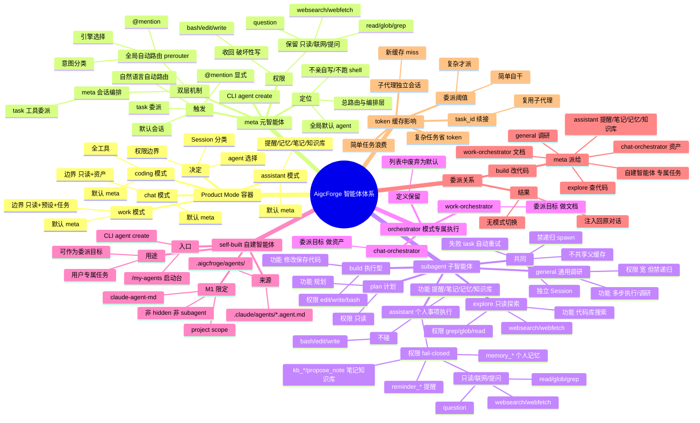

# 元智能体调度架构讨论总结（含思维导图）

> **类型**：设计讨论记录（NON-NORMATIVE）
> **日期**：2026-08-11
> **范围**：元智能体（meta）与子智能体、自建智能体、Product Mode 的调用关系、权限边界、委派机制、token/缓存影响
> **关联**：[Assistant PRD](../../prd/assistant-mode-personal-agent.md) §17、[My Agents PRD](../../prd/my-agents-launcher.md)、[ADR-11](../../architecture/adr/ADR-11-product-mode-session-classification.md)、[ADR-13](../../architecture/adr/ADR-13-chat-work-mode-boundary.md)
> **代码事实依据**：`packages/core/src/plugin/agent.ts`、`packages/core/src/agent.ts`、`packages/core/src/agent/meta/prerouter.ts`、`packages/core/src/tool/task.ts`、`packages/core/src/tool/task-driver.ts`、`packages/core/src/agent/file-loader.ts`、`packages/app/src/context/local.tsx`

---

## 1. 讨论脉络

从"Assistant 模式需要什么智能体"出发，逐层讨论：各模式 agent 列表现状 → 元智能体真实机制 → 元智能体使用方式 → chat/work 能否委派 → 是否全模式默认 meta → 委派成本与边界。结论收敛到"**全模式默认 meta，meta 判断后委派子代理**"这一简化方案。

---

## 2. 概念区分（先厘清四类实体）

| 概念 | 定义 | 来源 | 能否被委派 | 典型例子 |
|---|---|---|---|---|
| **元智能体 (meta)** | 总路由与编排层，全局默认 agent | 内置（`plugin/agent.ts`） | 不，它是委派发起方 | `meta` |
| **子智能体 (subagent)** | 被 meta 通过 task 委派执行的内置专用代理 | 内置 | ✅ | `build`、`explore`、`general`、`plan`、`assistant`（个人事项） |
| **自建智能体 (自定义 Agent)** | 用户配置的项目级专用 Agent | 用户文件 `.claude/agents/*.agent.md`（`file-loader.ts`） | ✅（可作为委派目标或启动会话） | 用户写的"审查 Agent"等 |
| **Product Mode** | Session 的分类与边界（chat/coding/work/assistant） | ADR-11 | 不是智能体，是容器 | `chat`、`coding`、`work`、`assistant` |
| **orchestrator（模式专属）** | 各模式的 fail-closed 执行 agent | 内置 | ✅（meta 可委派给它） | `chat-orchestrator`、`work-orchestrator` |

**四者关系一句话**：用户在某 **Mode** 的 Session 里 → 默认由 **meta** 编排 → meta 按意图**委派给子智能体或自建智能体**执行 → 结果注入回原对话。

---

## 3. 关键结论逐条

### 3.1 智能体体系现状（代码事实）

内建 agent 清单（`plugin/agent.ts`）：

| agent | mode | 权限特征 | 用途 |
|---|---|---|---|
| `default`(=build) | primary | 宽权限（含 edit/bash/write） | 通用执行（agent.ts:13 `defaultID = build`） |
| `plan` | primary | 只读 + 计划文件写 | 计划模式 |
| `general` | subagent | 宽权限，但**禁递归**（task_schedule/task_spawn deny） | 通用调研/多步执行 |
| `explore` | subagent | **`* deny` + 只读**（grep/glob/webfetch/websearch/read） | 代码库快速探索 |
| `chat-orchestrator` | primary | `* deny` + 只读 + propose_*_asset | Chat 专属（委派目标） |
| `work-orchestrator` | primary | `* deny` + 只读 + work-preset + task_* 增量 | Work 专属（委派目标） |
| `compaction`/`title`/`summary` | primary | 窄权限 | 内部工具 |
| `meta` | primary | 继承 defaults（宽）+ task/list_assets/question/plan_enter | 元智能体总路由 |

模式→agent 绑定（`product-mode-agent-policy.ts` + `local.tsx:74`）：chat→chat-orchestrator、work→work-orchestrator、coding/assistant→undefined（默认 agent = meta）。

### 3.2 元智能体是"双层机制"，不是简单的 UI 选项

- **第 1 层（全局自动路由）**：`prompt.ts:697` 在每个会话的每次输入都跑 `PreRouter.preRoute()` → 意图分类（code_modification→build、code_understanding→explore、content_creation→general、@mention→对应引擎）。**任何模式的任何会话都生效**。
- **第 2 层（meta 会话编排）**：meta 作为 agent 时，用 `task` 工具把任务分发给子代理，落地在 `task-driver-fill.ts`（subagent/external-cli/workflow 三类）。

**结论**：元智能体的编排能力不依赖"在 UI 列表里被选中"——它已是全局默认 agent（agent.ts:78 优先 meta），prerouter 自动路由全局生效。

### 3.3 元智能体使用方式（5 种入口）

1. **默认 agent**：coding/assistant 模式新建会话默认就是 meta。
2. **自然语言自动路由**：直接说"帮我调研/重构/查代码"，prerouter 自动分发。
3. **@mention 显式指定**：`@build xxx`、`@explore xxx`、`@general xxx`、`@claude-code xxx`。
4. **meta 会话内 task 委派**：meta 用 task 工具拆任务给子代理 + 汇总。
5. **CLI `agent create`**：创建自定义 `.agent.md` 子代理。

> ⚠️ `/my-agents` 页面当前无实现，仅有 PRD 草案（[my-agents-launcher.md](../../prd/my-agents-launcher.md)）。

### 3.4 全模式默认 meta 方案（用户方案）——结论：正确

**所有模式的默认 agent 都是 meta，meta 自行判断是否分派子代理。**

**确认正确**，比"orchestrator 升级为 meta"简单。原因：
- meta 已是默认 agent，改动收敛到"解除 chat/work 的 UI 锁定"。
- "跨模式委派/委派回来"的复杂度**在代码里不存在**——子代理是父会话下的通用子会话（`createChild` 只接收 `parentID`+`agent`，不强制 mode），从头到尾一个对话，无模式切换。

**需要的改动**：`modeDraft("chat")`/`modeDraft("work")` 改为 meta；`local.tsx:75` 去掉"只显示 orchestrator"过滤。

### 3.5 委派机制（task 工具）

- `subagent_type` 是自由字符串，可派 build/explore/general/plan/**orchestrator**/**自建智能体**（`agents.resolve` 解析任意注册 agent）。
- 子代理执行由 `createChild` + `delegate`/`delegateBackground`/`delegateJudge` 完成。
- 子代理结果通过 `delegateBackground` 的 inject 机制注入回父会话。
- 禁止递归：子代理不能再 spawn 子代理（task.ts:166）。

**用户委派语义映射**：修改/保存→**build**；查看/调研→**general** 或 **explore**；做资产→**chat-orchestrator**；做文档→**work-orchestrator**；用户专属任务→**自建智能体**。

### 3.6 子智能体边界与失败兜底

- **边界互不干扰**：explore 只读 fail-closed；general 宽权限但禁递归；build 执行型；orchestrator 各自 fail-closed。
- **失败兜底已存在**：`task.ts:499` 委派失败自动 **retry 一次**；重试前 cancel 孤儿会话（task.ts:389）；区分 `error`（可重试）/ `cancelled`（不重试）。

**结论**：不需要"meta 给所有子代理兜底"，task 层自动重试即可。

### 3.7 token / 缓存影响

| 维度 | 影响 |
|---|---|
| **缓存** | 子代理是独立 Session，**不共享父会话 prompt cache**；每次委派都是新 miss，除非 `task_id` 续接 |
| **Token（复杂任务）** | 委派反而**省**——子代理上下文小、不膨胀 |
| **Token（简单任务）** | 委派**浪费**——多一次往返 |
| **系统 prompt 缓存** | CacheShape 只解决"同会话多轮"，不解决"跨会话子代理"miss |

**建议配"委派阈值"**：meta 判断"复杂才派、简单自干"。

### 3.8 修正记录（2 和 3 的冲突）

| # | 问题 | 修正 |
|---|---|---|
| 1 | "meta 只编排不亲自执行（deny bash/edit/write）" 与 "简单任务自己干" 冲突 | **不冲突**：meta 保留**只读/联网/提问**权限（read/glob/grep/websearch/webfetch/question），收回的只有**破坏性写**（bash/edit/write）。简单只读自干，写操作委派 build |
| 2 | orchestrator 去留 | 列表中**废弃**为默认选项，但**定义/权限/功能保留**——作为 meta 的**委派目标**（做资产→chat-orchestrator、做文档→work-orchestrator） |
| 3 | `/my-agents` 是什么 | 独立于 meta 讨论。是**项目 Agent 启动台**（选用户自建 Agent + Work/Coding → 建会话），不是"所有智能体聊天入口"，不是命令 |
| 4 | assistant 模式缺执行者 | **需新建 `assistant` 子智能体**：fail-closed 权限承载个人事项（reminder/kb_*/propose_note/memory_*），meta 在 assistant 场景委派给它 |

---

## 4. 方向自查（我的方向是否有误）

| # | 我的早期判断 | 被修正为 | 依据 |
|---|---|---|---|
| 1 | "meta 不该平铺进模式 agent 列表" | 部分对：编排能力已全局生效，进不进列表只是权限语义问题 | prerouter 全局路由 + meta 已是默认 |
| 2 | "chat/work 需 orchestrator 上报 meta（方案 B）" | **放弃**：全模式默认 meta 更简单 | 用户方案 + 子代理无模式切换复杂度 |
| 3 | "meta 宽权限会让 chat 能用 shell" | 保留为唯一取舍：靠"meta 只编排 + 子代理各自权限"解决 | chat-orchestrator fail-closed 语义 |
| 4 | 反复提 /my-agents | **偏离**：/my-agents 是独立启动台，与 meta 编排解耦 | my-agents-launcher.md |

**总体判断**：用户方向（全模式默认 meta + 委派子代理）正确。早期方案 B 复杂化，应放弃。

---

## 5. 待决问题

1. **自建智能体如何进入委派**：用户 `.agent.md` 的 Agent 是否默认出现在 meta 的可委派列表（subagent_type）？还是需显式配置？
2. **meta 权限是否收敛**：是否给 meta 加"只编排不亲自执行"的约束（deny bash/edit/write），让写操作全走子代理？
3. **委派阈值落地**：system prompt 引导"复杂才派、简单自干"，还是引入复杂度判定？
4. **/my-agents 入口**：是否本次一并实现（独立 PRD 线）。

---

## 6. 元智能体与子智能体逻辑关系思维导图

---

## 7. 四者关系的一句话总结

**用户在某 Mode 的 Session 里 → 默认由 meta 编排 → meta 按意图委派给子智能体（build/explore/general/plan）或 orchestrator（chat/work）或自建智能体（用户 .agent.md）执行 → 结果注入回原对话。** 四者边界各自 fail-closed、互不干扰，失败由 task 自动重试，全程无模式切换。
